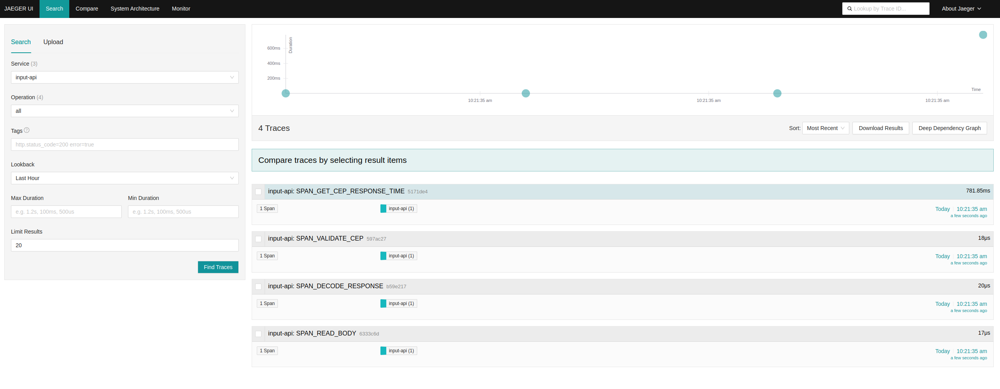
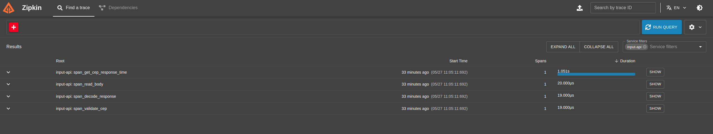
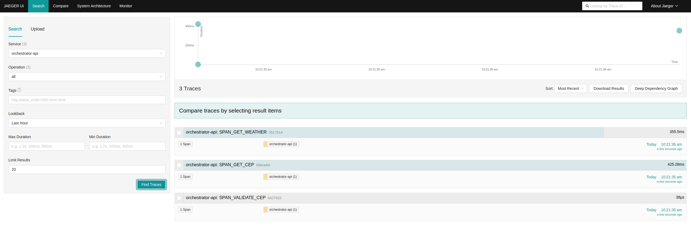
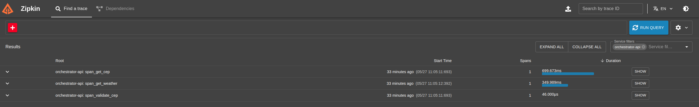

# goexpert-weather-api-otel
Projeto do Laboratório "Tracing distribuído e span" do treinamento GoExpert(FullCycle).


## O desafio
Desenvolver um sistema em Go que receba um CEP, identifica a cidade e retorna o clima atual (temperatura em graus celsius, fahrenheit e kelvin) juntamente com a cidade. Esse sistema deverá implementar OTEL(Open Telemetry) e Zipkin.

Basedo no cenário conhecido "Sistema de temperatura por CEP" denominado Serviço B, será incluso um novo projeto, denominado Serviço A.


## Como rodar o projeto
``` shell
## put the docker-compose containers up
make up 

## put the docker-compose containers down
make down

## make some request
make run
```


## Funcionalidades da Linguagem Utilizadas
- context
- net/http
- encoding/json
- testing
- testify


## Requisitos - Serviço A (responsável pelo input):
- [x] O sistema deve receber um input de 8 dígitos via POST, através do schema:  { "cep": "29902555" }
- [x] O sistema deve validar se o input é valido (contem 8 dígitos) e é uma STRING
- [x] Caso seja válido, será encaminhado para o Serviço B via HTTP
- [x] Caso não seja válido, deve retornar:
    - Código HTTP: 422
    - Mensagem: invalid zipcode


## Requisitos - Serviço B (responsável pela orquestração):
- [x] O sistema deve receber um CEP válido de 8 digitos
- [x] O sistema deve realizar a pesquisa do CEP e encontrar o nome da localização, a partir disso, deverá retornar as temperaturas e formata-lás em: Celsius, Fahrenheit, Kelvin juntamente com o nome da localização.
- [x] O sistema deve responder adequadamente nos seguintes cenários:
    - Em caso de sucesso:
        - Código HTTP: 200
        - Response Body: { "city: "São Paulo", "temp_C": 28.5, "temp_F": 28.5, "temp_K": 28.5 }
    - Em caso de falha, caso o CEP não seja válido (com formato correto):
        - Código HTTP: 422
        - Mensagem: invalid zipcode
    - ​​​Em caso de falha, caso o CEP não seja encontrado:
        - Código HTTP: 404
        - Mensagem: can not find zipcode


# Requisitos - Entrega
- [x] O código-fonte completo da implementação.
- [x] Documentação explicando como rodar o projeto em ambiente dev.
- [x] Utilize docker/docker-compose para que possamos realizar os testes de sua aplicação.


## Traces do input-api: Jaeger


## Traces do input-api: Zipkin



## Traces do orchestrator-api: Jaeger


## Traces do orchestrator-api: Zipkin



## Referências
- https://github.com/open-telemetry/opentelemetry-collector-contrib/tree/main/examples/demo
- https://github.com/openzipkin-attic/docker-zipkin/blob/master/docker-compose.yml
